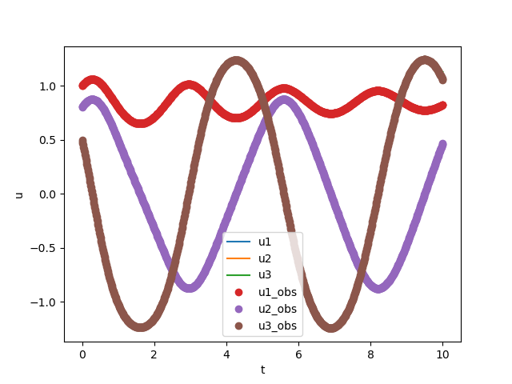

# Physics-Informed Neural Networks (PINNs)

This repository contains implementations of Physics-Informed Neural Networks (PINNs) for solving differential equations and modeling physical systems. The project includes examples such as the Kraichnan-Orszag problem and deep operator networks.

## Project Structure

```
.
├── training_param_plots/
├── Kraichnan-Orszag.py
├── Kraichnan-Orszag_solution.png
├── PI_DeepONet.py
├── README.md
├── cooling.py
└── oscilator_priod.py
```

## File Descriptions

- `training_param_plots/`: Directory containing plots of training parameters
- `Kraichnan-Orszag.py`: Implementation of the Kraichnan-Orszag problem using PINNs
- `Kraichnan-Orszag_solution.png`: Visualization of the Kraichnan-Orszag solution
- `PI_DeepONet.py`: Physics-Informed Deep Operator Network implementation
- `cooling.py`: PINNs application for cooling processes
- `oscilator_priod.py`: PINNs for modeling oscillator periods

## Kraichnan-Orszag Solution

The Kraichnan-Orszag problem is a challenging test case for numerical methods in fluid dynamics. Below is the visualization of the solution obtained using our PINN approach:



## Setup and Installation

1. Clone this repository:
   ```
   git clone https://github.com/your-username/pinns-project.git
   cd pinns-project
   ```

2. Install the required dependencies:
   ```
   pip install torch numpy matplotlib scipy
   ```

## Usage

To run the Kraichnan-Orszag problem simulation:

```
python Kraichnan-Orszag.py
```

For the Physics-Informed Deep Operator Network:

```
python PI_DeepONet.py
```

Modify the parameters in each script as needed for different configurations.

## Key Features

- Implementation of Physics-Informed Neural Networks
- Kraichnan-Orszag problem solver
- Physics-Informed Deep Operator Networks
- Applications in cooling processes and oscillator period modeling
- Visualization of results and training parameters

## Results

The `training_param_plots/` directory contains visualizations of various training parameters. Check these plots to understand the training process and model performance.

## Contributing

Contributions to improve the implementations, add new physical models, or enhance documentation are welcome. Please follow these steps:

1. Fork the repository
2. Create a new branch for your feature
3. Commit your changes
4. Push to the branch
5. Create a new Pull Request

## License

This project is licensed under the MIT License - see the [LICENSE](LICENSE) file for details.

## Acknowledgments

- The PINN methodology is based on the work of M. Raissi, P. Perdikaris, and G.E. Karniadakis
- The Kraichnan-Orszag problem is a well-known benchmark in computational physics
